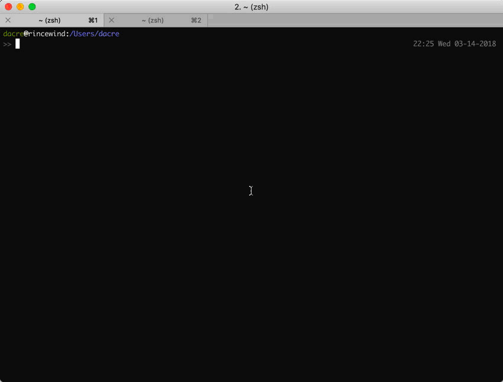

# Unified Tmux-ZSH-Vim Terminal Titles

Creates intelligent terminal titles in tmux, zsh, and vim, that work together
to give information about session, ssh host, path, and currently edited vim
buffer. Each part is modular and must be installed separately.

Note: the ZSH component of this is *heavily* influenced by
[jreese/zsh-titles](https://github.com/jreese/zsh-titles). The other components
are inspired by a variety of stack exchange answers.

## How it works

The three components of this plugin work together to make a useful
colon-separated title for any combination of tmux, zsh, and vim. For example, if
you are in a tmux session on your home computer with zsh at your home directory,
your title will be `t:0:~`, if your tmux session was named fred, it would be
`t:fred:~`. If you then opened `hi.txt` in vim or nvim, it would be
`t:fred:v:hi.txt`.

If by contrast, your did those same things over ssh on your remote machine
hubble, those would be: `t:hubble:0:~`, `t:hubble:fred:~`, `t:hubble:v:hi.txt`
instead. If you were the root user on hubble, the starting `t:` would instead be
`rt:`.



## Installation

### Tmux

Install with [tpm](https://github.com/tmux-plugins/tpm) by adding the following
line to your `.tmux.conf`:

```
set -g @plugin 'MikeDacre/tmux-zsh-vim-titles'
```

You will then need to source your tmux config (`tmux source ~/.tmux.conf`) and
install the plugin by pressing your prefix key combo (defaults to Ctrl+b)
followed by `I` (shift+i). You can update by running your prefix followed by
`U`.

### ZSH

The easiest way to install this plugin with ZSH is to use
[Antigen](https://github.com/zsh-users/antigen) by adding the following line to
the apprpriate spot in your `~/.zshrc` file:

```
antigen bundle MikeDacre/tmux-zsh-vim-titles
```

You will then need to reload your zsh configuration (e.g. by starting a new
shell or sourcing your `~/.zshrc` to install the plugin. You can update by
running `antigen upgrade`.

Alternatively, if you use
[oh-my-zsh](https://github.com/robbyrussell/oh-my-zsh), you can clone this into
your `oh-my-zsh` custom plugin directory:

1. `mkdir -p ${ZSH}/custom/plugins`
2. `cd ${ZSH}/custom/plugins`
3. `git clone https://github.com/MikeDacre/tmux-zsh-vim-titles.git`
4. Add `plugins+=(unified-titles)` to the right spot in your `~/.zshrc` and
   reloading zsh

To update you have to `cd` to the plugin directory and run `git pull`.

### Vim/NVIM

There are a great many plugin managers for vim/nvim right now, I personally use
[vim-plug](https://github.com/junegunn/vim-plug), to install with that manager,
just add the following line to the right spot in your `~/.vimrc` or
`~/nvim/init.vim`:

```
Plug 'MikeDacre/tmux-zsh-vim-titles'
```

You will then need to open a vim/nvim instance and run `PlugInstall` to install
the plugin. To update run `PlugUpdate`. The various other plugin managers work
similarly.

### Bash or another sh shell

If you also use a non-zsh shell, you can source the `bash-titles.plugin.sh` file
from your `~/.bashrc`. It doesn't do anywhere near as much as the ZSH version,
it simply sets the terminal title to the path, avoiding the otherwise long
titles that bash sometimes sets.

If anyone wants to port the zsh plugin to bash, that would be awesome. It should
be pretty easy, but I can't be bothered as I so rarely use bash.

## Configuration

The plugins will work right out of the box, but the formats can be configured
with a variety of shell variables. For example you could change the tmux prompt,
disable setting the window tab names, or change the delimiter from `:` to
something else.

### Tmux title configuration

Tmux is the first part of the title, the default title is `t:<session>:` on a
local machine, or `t:<session>:<hostname>` on a remote machine. The `t:` is
replaced with `rt` if you are root.

These variations are controlled by the following optional variables:

- `tmux_title_start='t:'`
- `tmux_title_root='rt:'`
- `tmux_title_format='#S:#T'`
- `tmux_title_format_ssh='#h:#S:#T'`
- `tmux_win_current_fmt='#I:#W#F'`
- `tmux_win_other_fmt='#I:#W#F'`
- `zsh_title_hosts='{}'`

The format strings that start with a `#` are tmux specific and can be found in
the tmux man page. `#S` is the session name, `#I` is the window number, `#h` is
the short hostname, it is modified by `zsh_title_hosts`. This variable holds a
JSON dictionary as a string and has hostname replacements, e.g.
`'{"fraser-server": "lab"}'`. This will convert the hostname fraser-server to
lab to shorten the title. For example, add something like this to your
`~/.profile` file and source it from bash and zsh:

```shell
export zsh_title_hosts='{
    "fraser-server": "lab",
    "esmeralda": "esme",
    "fruster": "fr"
}'
```
If the hosts did not load after sourcing, try running the script directly:
`bash ~/.tmux/plugins/tmux-zsh-vim-titles/unified-titles.tmux`

`#T` is the terminal title and is set by the zsh and vim plugins, without it
those other plugins **will not display their titles**.

Additionally, if `$tmux_set_window_status` is set, the window status tabs
will also be updated to include the terminal title, by default the window status
is set to '#I:#W#F', you can also ignore this setting and just do it manually:

```shell
tmux set-window-option -g window-status-current-format "#I:#T"
tmux set-window-option -g window-status-format "#I:#T"
```

This option also affects ZSH, which will rename the windows with a shortened
PATH.

Note, after altering any of these settings, run `tmux source ~/.tmux.conf` to
implement the changes.

### ZSH title configuration

Without this plugin, the default ZSH title is just the hostname. This plugin
replaces this with the directory path or `command:path` if a command is running
in the terminal.

There are two variables to customize the ZSH portion of the title:

- `zsh_title_fmt='${cmd}:${path}'`
- `path_width=40`

`zsh_title_fmt` controls the overall formatting of the title. Note the single
quotes, this is very important to prevent the variable from being expanded to
early, you must not use `"{cmd}:${path}"`, that will result in the string `:`
being passed to the plugin.

`path_width` controls the maximum width of the path to the current directory in
the title, if the path is longer than this, only the last n characters of the
path will be shown. Note, this uses named paths, so HOME is replaced with `~`
and any hashed directories are replaced with their name, e.g. with
[cdbk](https://github.com/MikeDacre/cdbk).

### Vim/NVIM title configuration

For all other commands, the title will be `command:path`, but for vim or NVIM,
instead we use `v:<buffer>`, e.g. `v:README.md` or `v:[BUFEXPLORER]`. This title
is updated immediately on any buffer change, which makes it very useful.

If vim is not updating the titlebar correctly, try setting
`$vim_force_tmux_title_change`. If this variable is set, the plugin will force
change the window title to the appropriate vim title and will issue shell title
instructions to try to force change the terminal title change. This works in
almost all cases, but there is a slight visual defect+overhead as the vim buffer
is redrawn on buffer change. For that reason it is off by default. If your vim
is not setting the title properly, try adding the following to your `.bashrc`,
`.zshrc`, or a sourced profile file:

`export vim_force_tmux_title_change=true`

The only format that can be changed for the vim title is the prefix, currently
set as `v:` to keep it out of the way:

- `vim_title_prefix="v:"`

Note, you can chose not to install the vim plugin, in which case either you will
end up with `vim:<path>` in the title, or another title produced internally by
vim, depending on your settings.
